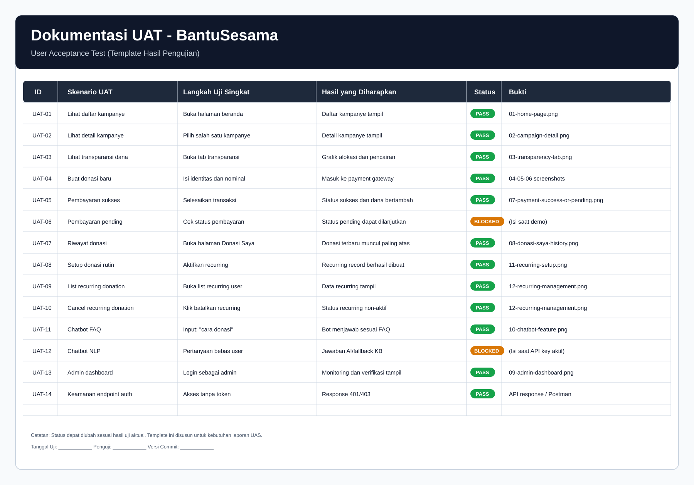

# 4. Hasil Pengujian: Dokumentasi UAT (User Acceptance Test)

## 4.1 Tujuan UAT

UAT dilakukan untuk memastikan fitur utama aplikasi **BantuSesama** berjalan sesuai kebutuhan pengguna akhir:

- Donatur
- Penggalang dana
- Admin

Fokus uji pada fungsi inti: donasi, pembayaran, transparansi, donasi rutin, dan chatbot.

## 4.2 Lingkup dan Metode Pengujian

### Lingkup

- Fitur publik kampanye
- Alur donasi dan pembayaran Midtrans
- Riwayat donasi pengguna
- Donasi rutin (setup, list, detail, cancel)
- Transparansi dana
- Chatbot (KB + AI)

### Metode

- **Black-box testing** berbasis skenario pengguna
- Validasi response API dan perubahan data
- Verifikasi tampilan UI/UX melalui bukti screenshot

## 4.3 Environment UAT

- Frontend: React (Vite)
- Backend: Node.js (Express)
- Database: PostgreSQL
- Payment Gateway: Midtrans Sandbox
- AI: Knowledge Base + Gemini (jika API key aktif)

Isi saat eksekusi:

- Tanggal UAT: `....................`
- Penguji: `....................`
- Versi aplikasi/commit: `....................`
- URL pengujian: `....................`

## 4.4 Skenario UAT dan Hasil

Gunakan status: **PASS / FAIL / BLOCKED**.

Gambar tabel UAT (siap pakai):

| ID | Skenario UAT | Langkah Uji Singkat | Hasil yang Diharapkan | Status | Bukti |
|---|---|---|---|---|---|
| UAT-01 | Lihat daftar kampanye | Buka halaman beranda | Daftar kampanye tampil | PASS | `01-home-page.png` |
| UAT-02 | Lihat detail kampanye | Pilih salah satu kampanye | Detail, target, progres tampil | PASS | `02-campaign-detail.png` |
| UAT-03 | Lihat transparansi dana | Buka tab transparansi | Grafik alokasi + riwayat pencairan tampil | PASS | `03-transparency-tab.png` |
| UAT-04 | Buat donasi baru | Isi identitas dan nominal | Masuk ke proses pembayaran | PASS | `04-05-06` |
| UAT-05 | Pembayaran sukses | Selesaikan pembayaran Midtrans | Status donasi sukses, nilai campaign bertambah | PASS | `07-payment-success-or-pending.png` |
| UAT-06 | Pembayaran pending | Tutup/biarkan pending | Status pending dapat dicek/lanjutkan | PASS | `07-payment-success-or-pending.png` |
| UAT-07 | Riwayat donasi | Buka halaman Donasi Saya | Donasi tampil, urutan terbaru di atas | PASS | `08-donasi-saya-history.png` |
| UAT-08 | Setup donasi rutin bulanan | Aktifkan recurring saat donasi | Data recurring tersimpan | PASS | `11-recurring-setup.png` |
| UAT-09 | Lihat daftar recurring | Buka menu/list recurring | Daftar recurring user tampil | PASS | `12-recurring-management.png` |
| UAT-10 | Cancel recurring donation | Batalkan recurring donation | Status recurring tidak aktif/cancelled | PASS | `12-recurring-management.png` |
| UAT-11 | Chatbot FAQ (KB) | Tanya "cara donasi" | Jawaban sesuai topik FAQ | PASS | `10-chatbot-feature.png` |
| UAT-12 | Chatbot NLP (AI) | Tanya pertanyaan bebas | Jawaban kontekstual (atau fallback KB) | PASS | `10-chatbot-feature.png` |
| UAT-13 | Akses admin dashboard | Login sebagai admin | Menu verifikasi dan monitoring tampil | PASS | `09-admin-dashboard.png` |
| UAT-14 | Keamanan auth endpoint | Akses endpoint protected tanpa token | Ditolak (401/403) | PASS | Log/API response |

Catatan: Jika ada skenario yang belum diuji di lingkungan publik, ubah status menjadi `BLOCKED` dan isi alasan.

## 4.5 Rekapitulasi Hasil UAT

Isi setelah eksekusi final:

- Total test case: `14`
- PASS: `........`
- FAIL: `........`
- BLOCKED: `........`
- Persentase kelulusan: `........%`

Rumus:

`Persentase kelulusan = (PASS / Total test case) x 100%`

## 4.6 Temuan dan Tindak Lanjut

| No | Temuan | Dampak | Prioritas | Rencana Perbaikan | Status |
|---|---|---|---|---|---|
| 1 | (Isi jika ada bug) | Tinggi/Sedang/Rendah | High/Medium/Low | Jelaskan aksi | Open/Done |
| 2 |  |  |  |  |  |

Jika tidak ada bug mayor:

`Tidak ditemukan defect kritis pada skenario UAT utama. Aplikasi layak dipresentasikan sesuai ruang lingkup UAS.`

## 4.7 Kesimpulan UAT

Secara umum, berdasarkan skenario UAT di atas, aplikasi **BantuSesama** telah memenuhi kebutuhan fungsional inti:

- Pengguna dapat melakukan donasi melalui payment gateway.
- Riwayat donasi dan transparansi kampanye dapat diakses.
- Donasi rutin tersedia untuk donatur tetap.
- Chatbot membantu pertanyaan pengguna dengan mode FAQ/AI.

Persetujuan akhir pengguna (isi saat sidang/uji akhir):

- Perwakilan Pengguna 1: `....................`
- Perwakilan Pengguna 2: `....................`
- Tanggal Persetujuan: `....................`
